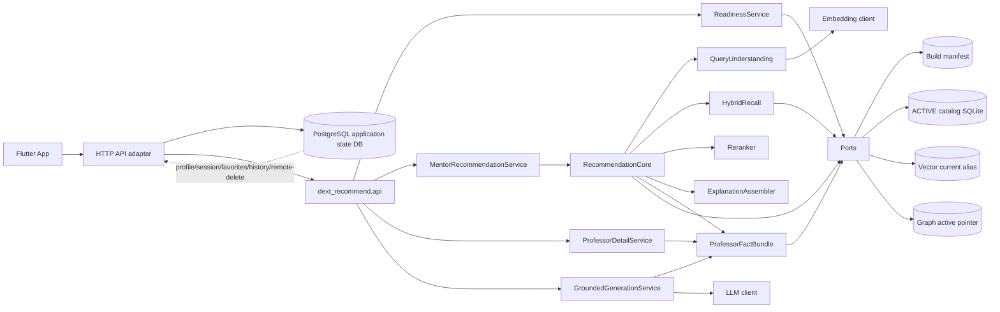

# dext 后端推荐系统设计

> 状态：持续修订；2026-07-02 将交付链收敛为 R3d → R4b → R5/R6 → R7a/R7b/R7c
>
> 日期：2026-06-30
>
> 设计版本：recommendation-design-v1.5-staged-delivery-gates
>
> 目标模块：`dext_recommend`，与 `dext`、`dext_graph`、`dext_monitor` 平级
>
> 前置产物：catalog 只读库存在经 READY/ACTIVE 发布的唯一指针与 validation manifest，并具备 Neo4j active pointer 和 Qdrant current alias
>
> 本文是 `dext_recommend` 的 **overview spec**：只定义跨子 spec 的架构、模块边界、共享不变量、语义与依赖序。每个落地步骤的详细数据结构、算法、接口与验收标准见对应子 spec。共享的受约束生成与事实引用契约见 [dext-grounded-generation](2026-06-30-dext-grounded-generation-design.md)。

## 1. 审查结论

原设计的模块边界、只读消费 ACTIVE build、强调可解释推荐这三点是正确的。根据 `docs/appside/PROJECT_FEATURE_OVERVIEW.md` 和 `docs/appside/PRODUCT_FEATURE_GUIDE.md`，后端推荐系统还必须支撑 App 的完整导师闭环，而不只是一次性相似教师查询：

- 首页导师入口需要自然语言输入后原地展示 `QueryUnderstanding` 和推荐卡片。
- 对话页需要支持“更多导师 / 同领域 / 换方向 / 细节追问”的路由，并支持围绕某位导师的 fork 式追问。
- 导师详情页需要稳定的事实包、数据来源和可回到原会话的上下文标识。
- 匹配分析、套磁邮件和导师对比都必须基于导师事实与用户档案生成，不能产生无来源事实，也不能预测录取概率。
- 收藏、历史、个人档案属于 App/API 应用层能力；推荐核心可以消费脱敏后的用户背景，但不应把用户画像写入建图事实层。
- `dext_recommend` 必须与 `dext`、`dext_graph`、`dext_monitor` 保持平级关系，不 import、不调用、不复用这些模块的内部 Python API，只消费已发布的 ACTIVE 产物契约。
- App 侧 OpenAPI 契约已提供在 `docs/appside/openapi.yaml`。本文固化推荐核心能力面与语义；HTTP adapter 的正式字段名与精确路径以该 OpenAPI 为准。

本文定义推荐核心、HTTP 适配能力、会话语义、发布产物契约和质量门禁。后续 OpenAPI 只能做字段映射和权限包装，不应改变推荐核心逻辑。

## 2. 产品目标与范围

推荐系统是 SchoNavi 导师推荐链路的后端查询层。v1 首先服务“学生按研究兴趣找导师”，目标是可解释的精准推荐，并能继续驱动详情、匹配分析、套磁邮件和横向对比。

核心目标：

1. 学生输入研究兴趣、学校/城市/院系偏好、升学阶段、个人背景等信息。
2. 系统先输出需求理解，再返回少量高质量导师候选。
3. 每个候选都能解释为什么匹配，包括命中的研究方向、Topic、导师资格、来源页面和数据可信度。
4. 推荐结果可以被详情页、匹配分析、套磁邮件、导师对比、收藏和历史复用。
5. 推荐模块只读消费已发布的 ACTIVE build 产物，不触发爬取、建图、监控、发布、回滚或 GC。

v1 优先保证 precision、解释真实性、过滤正确性和 App 闭环可用性。覆盖率不足时返回结构化 warning，不用未发布数据、爬虫调度图或在线事实生成来补洞。

竞赛推荐、备赛计划和智能日历属于 SchoNavi 的另一条产品线，不纳入导师 `dext_recommend` v1。新增 `data/竞赛助手/` 知识库后，这条产品线应由独立的竞赛助手后端 spec 承接；它可以复用可解释推荐、事实引用和受约束生成原则，但不得与教师事实图、导师 ranking profile 或导师 ACTIVE build 混在同一模块实现。

## 3. 模块边界

推荐模块新增为平级包：

```text
src/
  dext/             # 爬虫、源库、抓取状态机
  dext_graph/       # catalog、curation、Neo4j/Qdrant 构建与发布
  dext_monitor/     # 只读构建观测
  dext_recommend/   # 推荐查询、召回、重排、解释、API 适配
```

职责边界：

| 模块 | 职责 | 推荐侧禁止事项 |
|---|---|---|
| `dext` | 生产每所学校 SQLite 源数据 | 不读取源 SQLite、不读取爬虫调度图、不 import `dext.*` 内部模块 |
| `dext_graph` | 生成 catalog、Neo4j 事实图、Qdrant 教师索引，完成 ACTIVE 发布 | 不 import `dext_graph.*`，不修改 catalog，不触发 build/resume/validate/promote/gc/archive |
| `dext_monitor` | 只读展示构建状态和拓扑 | 不 import `dext_monitor.*`，不复用 monitor API 作为推荐数据面 |
| `dext_recommend` | 查询解析、候选召回、重排、解释、事实包、HTTP 适配 | 不写回 Neo4j/Qdrant，不产生正式图事实，不依赖其他平级模块内部 API |
| App/API 应用层 | 用户档案、会话、收藏、历史、权限、远端资料删除 | 不把用户画像写入 catalog/Neo4j/Qdrant 教师事实 |

系统级产物流向必须单向：

```text
dext -> published source snapshots -> build artifacts -> dext_recommend -> App/API
                                           \-> dext_monitor
```

代码依赖规则：

- `dext_recommend` 与 `dext`、`dext_graph`、`dext_monitor` 只共享稳定的文件/数据库/服务协议，不共享内部类、函数或 ORM model。
- 若需要复用 schema，优先把 schema 固化为版本化 manifest、SQL view、OpenAPI/JSON Schema 或独立协议文档，而不是跨包 import。
- `dext_recommend` 可以有自己的 reader/adapter，但这些 adapter 只能面向发布产物协议。
- `dext_recommend` 可以调用 LLM 做需求理解、追问路由、匹配分析、邮件草稿和对比文案，但 LLM 输出只能消费已选事实包与用户档案，不能写成教师事实，也不能覆盖 catalog/Neo4j/Qdrant 中的事实。

## 4. 本次本地审查发现

以下是截至 2026-07-02 的本地观察，不属于推荐模块的长期运行假设。若状态变化，以 catalog、Neo4j、Qdrant readback 为准：

- 本地 catalog 只有一个 build，状态为 `WRITING_VECTOR`，`taxonomy_version=null`，尚未进入 `VALIDATING -> READY -> ACTIVE`。
- 当前库有 11,801 canonical professors、40,042 ResearchStatement、75,135 PublicationMention；
  但缺 `statement_topic_links` 与 `professor_profiles`，不能用于 R4 live 验收。
- 没有 ACTIVE build 时可以继续 fixture/临时 SQLite 驱动的内部开发，但不得把 staging 数据接入在线查询。
- `docs/appside/openapi.yaml` 是全 App 契约；推荐模块只拥有 recommendation/chat/professor/profile/favorites/history/account 子集。
- append-only source observation 增强仍是可选设计；首次上线硬门禁是证据可追溯、ACTIVE 产物一致和评测达标。

推荐模块可以先开发内部接口和离线测试，但线上服务必须等 ACTIVE build、Qdrant alias、Neo4j active pointer 和必要 payload 对账能力补齐后才能放量。

## 5. App 侧能力契约

App 当前有 `DataSource.llm` 与 `DataSource.http` 两种接线方式。HTTP 模式下，后端需要提供与以下产品能力等价的服务。路径以 `docs/appside/openapi.yaml` 为准；OpenAPI `servers.url=/api/v1`，下表省略该前缀。

| 能力 | 后端责任 | 推荐核心参与度 |
|---|---|---|
| 首页导师推荐 `POST /recommendations/mentors` | 接收自然语言、用户背景摘要和筛选条件，返回需求理解、推荐卡片、warning | 核心 |
| 对话 `/chat/...` | 管理或接收 session/turn/fork 上下文，路由更多导师、同领域、换方向、细节追问 | 核心提供推荐与事实工具，应用层管理会话 |
| 导师详情 `GET /professors/{professor_id}` | 返回事实包、研究方向、简介、数据来源、可用动作 | 核心 |
| 匹配分析 `POST /professors/{professor_id}/match-analysis` | 基于用户档案和导师事实生成维度分析，不预测录取概率 | 核心提供事实包，LLM 文案受约束 |
| 套磁邮件 `POST /professors/{professor_id}/outreach-email` | 基于用户档案和导师事实生成可编辑草稿，不自动发送 | 核心提供事实包，LLM 文案受约束 |
| 导师对比 `POST /professors/compare` | 对 2-3 位导师输出横向对比，必须基于事实包 | 核心提供事实包，LLM 文案受约束 |
| 个人档案 `/profile` | 保存、更新、删除用户背景，给推荐提供脱敏摘要 | App/API 应用层 |
| 收藏 `/favorites` | 保存导师收藏列表，支持后续对比和套磁入口 | App/API 应用层 |
| 历史 `/history` | 保存搜索与对话历史，可回到推荐结果和追问上下文 | App/API 应用层 |

推荐卡片最小展示语义：

```text
entity_id
display_name
university
org_units
title
research_summary
match_level
short_reasons
risk_flags
available_actions: detail|match|email|compare|favorite|follow_up
```

导师详情最小展示语义：

```text
entity_id
display_name
university
org_units
title
profile_url
research_statements
bio
publications
topics
mentor_eligibility
data_sources
recommendation_evidence: optional
available_actions
```

## 6. 系统架构规划

### 6.1 架构原则

后端推荐系统按“无状态推荐核心 + 有状态 API 应用层 + 发布产物 ports/adapters”规划：

1. `dext_recommend` 核心不保存用户会话、收藏、历史或 profile，只消费调用方传入的脱敏上下文。
2. API 应用层负责认证、权限、session/fork、profile、收藏、历史、远端资料删除和 OpenAPI 字段适配。
3. 推荐核心每次请求绑定一个 `ActiveBuildSnapshot`，但核心只依赖 `ActiveSnapshotProvider`、`VectorSearchPort`、`ProfessorFactPort` 等接口，不直接认识 catalog/Qdrant/Neo4j 客户端。
4. LLM 只作为受约束的语言与推理组件，用于需求理解、追问路由、匹配分析、套磁邮件和对比文案；教师事实仍来自事实包。
5. 向量 payload filter 只做召回加速，最终过滤和解释证据以事实端口 hydration 结果为准。
6. 所有排序、解释、生成 prompt、阈值和输出策略必须版本化，进入 `ranking_profile_version` 或独立 generation profile。
7. `dext_recommend` 不 import `dext`、`dext_graph`、`dext_monitor`；读写边界由发布产物协议、环境变量和 adapter 配置表达。

### 6.2 运行时拓扑



`Ports` 是 `dext_recommend` 自己定义的抽象协议，不是 `dext_graph` 的内部 API。`Application state DB` 明确使用 PostgreSQL（本地开发由 `docker/compose.yaml` 的 `postgres:16-alpine` 提供，通过 `DEXT_APP_DATABASE_URL` 连接），不得与 catalog 混用。catalog 是 build 事实库；PostgreSQL 是用户数据与会话库，owner scope 由 `owner_id` 绑定。

### 6.3 建议包结构

```text
src/dext_recommend/
  __init__.py
  config.py                 # env/config，超时、limit、ranking profile 路径
  models.py                 # 内部 request/response dataclass 或 pydantic model
  errors.py                 # 结构化错误码与 warning
  readiness.py              # ActiveBuildSnapshot 构建、刷新、健康检查

  api/
    schemas.py              # OpenAPI/HTTP DTO，字段名跟 App 契约对齐
    adapters.py             # DTO <-> 内部模型转换
    routes.py               # HTTP routes，薄 handler
    auth.py                 # viewer permissions 与 include_contacts 控制

  ports/
    active_snapshot.py      # ActiveSnapshotProvider，只暴露已验证 snapshot
    release_readback.py     # R2 catalog/vector/graph 原始发布 readback
    vector_search.py        # VectorSearchPort，召回与 alias/count readback
    professor_facts.py      # ProfessorFactPort，按 entity_id 读取事实包
    embedding.py            # QueryEmbeddingPort，按 ACTIVE fingerprint 编码 query
    generation.py           # LLMGenerationPort，受约束生成

  adapters/
    catalog_release.py      # 只读读取 catalog ACTIVE/validation/promotion 元数据
    catalog_sqlite.py       # 面向 catalog 发布 schema 的只读 SQL adapter
    vector_qdrant.py        # 面向 Qdrant alias/payload 协议的 adapter
    graph_neo4j.py          # 面向 Neo4j active pointer/graph schema 的 adapter
    embedding_provider.py   # OpenAI-compatible embedding adapter
    llm_provider.py         # OpenAI-compatible chat/json adapter

  core/
    service.py              # RecommendRequest -> RecommendResponse 编排
    query_understanding.py  # 需求理解，输出 QueryUnderstanding
    intent.py               # new_search/more_mentors/same_field/refine/detail 路由
    recall.py               # dense/sparse/hybrid recall 与 fusion
    filters.py              # payload pre-filter + hydrated final filter
    rerank.py               # score components、match_level、tie-break
    explanation.py          # explanation items 与 evidence refs
    cards.py                # 推荐卡片装配
    validation.py           # response validation

  facts/
    professor_detail.py     # ProfessorDetail 事实包组装
    evidence.py             # snippet 选择、provenance refs、source URL 规范化

  generation/
    grounding.py            # 事实包裁剪、引用校验、禁止无来源事实
    match_analysis.py       # 匹配分析
    outreach_email.py       # 套磁邮件草稿
    comparison.py           # 2-3 位导师对比
    prompts.py              # 版本化 prompt 与 JSON schema

  eval/
    datasets.py             # query set / conversation / groundedness 样本
    metrics.py              # nDCG、Precision、groundedness 等指标
    harness.py              # 可复现评测入口
    manifest.py             # build/ranking/generation 版本记录
```

推荐核心不得导入 `api.routes`、具体 adapter、用户数据库 adapter 或 monitor service。`api` 可以依赖 `core`、`facts` 和 `generation`，但业务逻辑只能向下调用，不在 handler 中分叉实现。具体 adapter 只在 composition root 装配到 ports，单元测试默认使用 fake ports。

### 6.4 关键请求流

导师推荐：

```text
HTTP request
  -> API auth/profile/session adapter
  -> RecommendRequest
  -> ReadinessService.get_snapshot()
  -> QueryUnderstanding + intent routing
  -> await query embedding
  -> await VectorSearchPort hybrid recall
  -> await ProfessorFactPort hydration and final filter
  -> rerank + explanation + card assembly
  -> API response + optional application-history write
```

导师详情：

```text
entity_id
  -> snapshot check
  -> ProfessorFactPort identity/profile/readable fields
  -> ProfessorFactPort affiliations/topics/evidence relationships
  -> source URL/provenance normalization
  -> ProfessorDetail
```

细节追问：

```text
session/fork context + anchor_entity_id + user question
  -> validate anchor in ACTIVE build
  -> ProfessorDetail fact bundle
  -> grounded answer or same_field/refine recommendation route
```

匹配分析、套磁邮件、导师对比：

```text
entity_id(s) + authorized StudentContext
  -> ProfessorDetail fact bundle(s)
  -> fact trimming and citation map
  -> constrained LLM JSON/Markdown output
  -> grounding validation
  -> response with warnings when evidence is missing
```

### 6.5 服务边界与部署

v1 推荐采用“一个 HTTP 服务进程 + 外部发布产物”的部署形态：

- HTTP 服务：承载 `POST /recommendations/mentors`、`GET /professors/{professor_id}`、chat adapter、match/email/compare adapter（均挂在 `/api/v1` server 下）。
- catalog release metadata：推荐服务从 catalog 唯一 ACTIVE 行及 validation/promotion 记录读取发布元数据，不调用建图模块命令。
- catalog SQLite：作为发布产物只读挂载，推荐服务不得执行 migration 或写入。
- Qdrant：通过 `VectorSearchPort` 只访问 `dext_professors_current` alias，启动和健康检查必须 readback alias target。
- Neo4j：通过 `ProfessorFactPort` 只读访问 active pointer 和当前 build 子图。
- App state DB：PostgreSQL，由 API 应用层管理 anonymous identity、profile、session、fork、turn/message/feedback、favorites、history 和远端资料删除；推荐核心只通过 DTO 获取必要上下文。
- LLM/Embedding provider：独立 client、独立超时、重试和脱敏日志；embedding 配置必须与 ACTIVE build fingerprint 对齐。

R7b HTTP adapter 使用仓库已有 aiohttp + Pydantic v2；框架不得进入 `core`。若后续已有 App 后端服务，
优先把 `dext_recommend` 作为平级库嵌入，只装配自身 ports/adapters，不导入 `dext_graph` 内部代码；
当负载或部署隔离需要时，再拆成独立推荐服务。

### 6.6 缓存与并发

允许的缓存：

- `ActiveBuildSnapshot` 短 TTL 缓存，release pointer 不一致时立即失效并拒绝混合版本。
- 热门 `ProfessorDetail` 只读缓存，key 必须包含 `build_id` 和 `profile_hash`。
- query understanding 和 LLM generation 不默认缓存；如需缓存，key 必须包含脱敏 query hash、student context hash、build_id 和 prompt/profile version。

并发约束：

- 推荐请求全链路设置总超时，外部依赖设置分段超时。
- Qdrant、Neo4j、embedding、LLM client 使用独立连接池和并发上限。
- 召回 oversample、hydration batch size、LLM 输入证据长度都必须配置化。
- 单个请求内所有异步任务共享同一 snapshot，不允许刷新后继续合并结果。
- 缓存 key 必须基于发布产物版本，不基于 adapter 实现类名或其他模块内部状态。

异步契约：Qdrant、Neo4j、catalog/release readback、embedding、LLM 与应用数据库等可能阻塞的 I/O ports 均定义为 `async def`，编排服务与 HTTP handler 必须 `await`。`ActiveSnapshotProvider.get_snapshot()` 是进程内原子缓存读取，保持同步；过滤、排序、校验、DTO 映射等纯计算也不机械 async 化。无原生异步客户端时，adapter 必须在线程卸载边界执行并应用超时与并发上限。

### 6.7 架构退出标准

进入功能实现前，架构骨架至少满足：

- `dext_recommend` 包存在，`api/core/ports/adapters/facts/generation/eval` 边界清晰。
- `RecommendRequest`、`RecommendResponse`、`ProfessorDetail`、`ActiveBuildSnapshot`、错误码模型稳定。
- readiness 能在缺 ACTIVE、alias 缺失、Neo4j pointer 缺失、三端不一致时返回结构化错误。
- API handler 只有 adapter 与权限逻辑，推荐测试可绕过 HTTP 直接调用 core。
- fake ports 可支持单元测试，不依赖真实外部服务完成核心逻辑测试。
- import boundary 测试或静态检查确认 `dext_recommend` 不导入 `dext`、`dext_graph`、`dext_monitor`。

## 7. v1 推荐语义

v1 推荐场景：学生找导师。

输入语义：

- `query_text`：研究兴趣或升学目标自然语言，支持中文、英文、中英混合、缩写和宽泛方向。
- `student_context`：可选用户背景摘要，包括阶段、专业、学校、研究兴趣、科研/竞赛经历、准备程度等。
- `filters`：学校、城市、院系、Topic、职称族、硕导/博导资格、是否包含 `review` 候选。
- `conversation_context`：可选会话、turn、fork、锚定导师和追问意图。
- `limit`：默认 10，最大 50。
- `ranking_mode`：默认 `explainable_precision`。

过滤语义：

| 条件 | 默认语义 |
|---|---|
| 学校、城市、院系 | 硬过滤 |
| 硕导/博导资格 | 硬过滤，除非请求声明为偏好 |
| 职称族 | 硬过滤，除非请求声明为偏好 |
| Topic | 默认软增强；请求可声明为硬过滤 |
| 用户阶段、专业、经历 | 默认个性化增强，不作为事实过滤 |
| `role_status=excluded` | 永不返回 |
| `role_status=review` | 默认不返回；显式包含时降权并标记风险 |

输出语义：

- `QueryUnderstanding`：系统理解到的研究兴趣、学校偏好、资格要求、缺失信息和是否需要追问。
- 候选教师基本信息：entity ID、姓名、学校、院系、职称、导师资格、主页。
- 推荐卡片字段：匹配等级、短推荐理由、风险标记、可用动作。
- 排序分数、score components、`ranking_profile_version`。
- 解释证据：命中的 ResearchStatement、Topic、代表成果片段、来源 URL、provenance ref。

隐私边界：

- 默认列表结果不返回 email/phone。
- 若 App 需要联系方式，必须通过独立字段开关和权限策略控制。
- 推荐日志不得记录 API key、完整 embedding 向量、用户身份敏感信息、未脱敏联系方式或可反推出个人身份的长 query 原文。
- `student_context` 只参与本次推荐和受控的用户历史，不进入建图事实层。

## 8. 内部接口

推荐核心先定义为进程内接口，不绑定 HTTP：

```text
async RecommendationCore.recommend(request: RecommendRequest) -> RecommendResponse
```

```text
RecommendRequest
  query_text: str
  student_context: StudentContext | null
  filters: RecommendationFilters
  conversation_context: ConversationContext | null
  limit: int = 10
  oversample: int = 200
  ranking_mode: "explainable_precision"
  review_policy: "exclude|include_downranked" = "exclude"
  include_contacts: bool = false
  diagnostics_level: "none|summary|debug" = "summary"

StudentContext
  education_stage: str | null
  school: str | null
  major: str | null
  gpa_bucket: str | null
  rank_bucket: str | null
  research_interests: list[str]
  achievements_summary: str | null
  competition_experience_summary: str | null
  profile_completeness: float | null

ConversationContext
  session_id: str | null
  turn_id: str | null
  main_session_id: str | null
  source_turn_id: str | null
  anchor_entity_id: str | null
  intent: "new_search|more_mentors|same_field|refine_direction|detail_followup" | null
  intent_source: "explicit|implicit" | null
  intent_confidence: float | null
  prior_result_entity_ids: list[str]

RecommendationFilters
  university_ids: list[str] = []
  city_names: list[str] = []
  org_unit_ids: list[str] = []
  title_families: list[str] = []
  master_eligibility: "any|confirmed" = "any"
  phd_eligibility: "any|confirmed" = "any"
  topic_ids: list[str] = []
  topic_filter_mode: "soft|hard" = "soft"

RecommendResponse
  build_id: str
  ranking_profile_version: str
  embedding_fingerprint: str
  taxonomy_version: str | null
  query_understanding: QueryUnderstanding
  query: QueryDiagnostics
  results: list[RecommendedProfessor]
  suggested_followups: list[str]
  warnings: list[RecommendationWarning]
```

`RecommendedProfessor` 最小语义：

```text
entity_id
display_name
university
org_units
title
title_family
master_eligibility
phd_eligibility
role_status
profile_url
research_summary
match_level
short_reasons
score
score_components
matched_topics
matched_statements
matched_publications
evidence_refs
risk_flags
available_actions
```

辅助服务接口：

```text
async get_professor_detail(entity_id, include_contacts, viewer_permissions) -> ProfessorDetail
async analyze_match(entity_id, student_context, evidence_policy) -> MatchAnalysis
async draft_outreach_email(entity_id, student_context, tone, language) -> OutreachDraft
async compare_professors(entity_ids[2..3], student_context, evidence_policy) -> ProfessorComparison
```

OpenAPI 适配层只负责：

1. 把 App 契约转换为内部 request。
2. `await` 推荐核心或辅助服务。
3. 把 response 映射回 OpenAPI。
4. 执行身份、权限、收藏/历史/profile 存储等应用层逻辑。

不得在 HTTP handler 中实现排序、过滤、证据查询、降权、解释生成或联系方式权限以外的推荐业务逻辑。

## 9. ACTIVE build 一致性

推荐服务必须通过 `ActiveBuildSnapshot` 读取数据。R2 从 raw release ports 构建 snapshot，再由 `ActiveSnapshotProvider` 暴露，至少包含：

```text
build_id
catalog_schema_version
neo4j_active_build_id
qdrant_alias_target
qdrant_payload_schema_version
embedding_provider
embedding_model
embedding_dimension
embedding_fingerprint
taxonomy_version
ranking_profile_version
created_at
```

snapshot 构建规则：

1. 从 release manifest 或 catalog release pointer 读取唯一 ACTIVE build ID。
2. 读取 vector current alias 指向的 physical collection，并 readback payload 中的 build ID。
3. 读取 graph active pointer 指向的 build。
4. 三者 build ID 必须一致，embedding dimension/fingerprint 必须一致。
5. 校验通过后生成不可变 snapshot；一次推荐请求、详情请求、匹配分析、套磁邮件或对比请求只能使用同一个 snapshot。

允许后台定期刷新 snapshot，也允许每次请求前刷新；无论实现选择如何，刷新失败不得污染当前已验证 snapshot。若 promotion 期间发现三端不一致，服务返回 `active_build_inconsistent`，不能混合旧/新版本继续响应。

允许的发布产物：

- catalog ACTIVE/validation metadata：build ID、schema version、embedding settings、taxonomy version；ranking/generation profile 由各自版本文件提供。
- catalog SQLite 只读发布 schema：canonical professor、profile metadata、ResearchStatement、PublicationMention、quality findings。
- vector store current alias：dense/sparse 召回和 payload filter。
- graph store active pointer：Topic 路径、院系/学校关系、可解释子图和图关系 readback。

不允许的读取源：

- 每所学校源 SQLite。
- `crawl_graph_nodes` / `crawl_graph_edges` 爬虫调度图。
- 未发布的 staging collection 或未 ACTIVE 的 Neo4j 子图。
- `dext`、`dext_graph`、`dext_monitor` 的内部 Python API、ORM model、service class 或 CLI command。

## 10. 需求理解与对话路由

App 侧导师链路会先展示需求理解卡，再进入推荐或追问。后端需要输出结构化 `QueryUnderstanding`：

```text
research_interests
preferred_universities
preferred_cities
preferred_org_units
degree_goal
mentor_eligibility_requirement
missing_information
needs_clarification
confidence
```

对话路由语义：

| intent | 后端行为 |
|---|---|
| `new_search` | 按当前 query 和用户背景生成新推荐 |
| `more_mentors` | 在同一理解和过滤下补充候选，默认排除已返回 entity IDs |
| `same_field` | 以锚定导师或上一轮 Topic 为正向上下文，找同领域导师 |
| `refine_direction` | 合并用户新限制后重新推荐 |
| `detail_followup` | 以锚定导师事实包回答，不触发宽召回，除非用户显式要求更多导师 |

intent 来源必须显式区分：

- `explicit` intent 来自 App 按钮、菜单或其它枚举动作，例如“更多导师”“找同领域导师”。后端只做枚举校验、状态转移校验和上下文完整性校验；校验通过后按枚举执行，不再让 LLM 重新解释。
- `implicit` intent 来自自由文本追问。后端用轻量约束分类器或 LLM JSON 输出 `{intent, confidence, rationale}`，只接受白名单枚举；输出无法解析、枚举非法、缺少必要上下文或置信度低于版本化阈值时，返回 `needs_clarification`，不得直接触发宽召回。
- `conversation routing accuracy` 只评估 `implicit` intent；`explicit` intent 通过 API contract、枚举校验和状态转移测试覆盖。

fork 式追问约束：

- `anchor_entity_id` 必须是 ACTIVE build 中存在且可解释的教师。
- fork 会话不得污染主会话的结果集；应用层可以保存 `main_session_id` 和 `source_turn_id`，推荐核心只消费上下文。
- 细节追问不能让 LLM 编造导师事实；只能基于 `ProfessorDetail` 事实包、证据片段和来源回答。
- 若用户从锚定导师转为“找类似导师”，显式按钮可直接传 `same_field` 或 `refine_direction`；自由文本必须先通过 `implicit` intent 分类，低置信时追问澄清。

## 11. 查询与召回

推荐 pipeline：

```text
query_text + student_context + conversation_context
  -> validate/normalize
  -> query understanding and intent routing
  -> query embedding with ACTIVE build embedding settings
  -> VectorSearchPort dense+sparse hybrid recall
  -> payload pre-filter
  -> ProfessorFactPort hydration and final filter
  -> deterministic rerank
  -> explanation and card assembly
  -> response validation
```

默认策略：

1. `query_text` 为空、过长或只含无意义字符时返回结构化错误。
2. query 使用与 ACTIVE build 相同的 embedding provider、model、dimension、prefix、tokenizer identity 和 sparse tokenizer。
3. Qdrant 召回默认初始 `oversample=200`；这不是固定候选数。存在学校、院系、导师资格、职称族等强硬过滤时，召回层必须按过滤选择性动态放大 candidate pool，配置上限默认不超过 1000。
4. payload filter 用于提前缩小候选；最终过滤必须基于 hydrated catalog/Neo4j 事实重新执行。若强硬过滤依赖的 payload 字段缺失、覆盖率不足或 readback 不达标，不得静默退化为固定 200 后过滤。
5. `excluded` 永不返回。
6. `review` 默认不返回；`include_downranked` 时可以返回，但必须降权并显示原因。
7. 没有 ResearchStatement 的教师只在强过滤命中或语义分数很高时进入候选，并显示 `missing_research_statement`。
8. Topic 是增强信号，不是默认硬依赖；无 Topic link 不应直接排除候选。
9. `prior_result_entity_ids` 用于“更多导师”时默认排除已展示结果；普通新搜索不默认排除。

强硬过滤下的 adaptive oversample 规则：

- 对 `university_ids`、`org_unit_ids`、`master_eligibility`、`phd_eligibility`、硬 Topic、`title_families` 等过滤，优先下推到 vector payload pre-filter。
- 对 `org_unit_ids` 这类高选择性过滤，readiness 必须验证 payload 字段存在、非空覆盖率达标，并能通过样本 readback 与 catalog/graph 事实对账；不达标时，院系硬过滤请求返回结构化 error 或 warning，由版本化策略决定是否拒绝服务。
- 若 payload pre-filter 可用但候选不足，按 `200 -> 400 -> 800 -> 1000` 或等价版本化步进扩大 prefetch，并进行 hydration loop，直到 post-filter 候选足够返回 `limit`、达到上限或 vector 候选耗尽。
- 若 payload pre-filter 不可用但请求只含低选择性硬过滤，可以先召回再 hydration final filter；响应必须携带 `payload_prefilter_degraded` 诊断，并记录 recall count、hydrated count、post-filter count。
- 若达到上限后仍无候选，返回 `no_candidates_after_filters`，并带上过滤诊断；不得返回未通过硬过滤的候选补位。

hybrid recall 默认使用 RRF（Reciprocal Rank Fusion）在排名层融合 dense 和 sparse 候选。可以由 Qdrant 原生 hybrid/RRF 查询实现；若当前客户端不支持，则分别执行 dense 和 sparse 搜索后在推荐模块内用版本化 RRF 合并。禁止把 raw dense cosine 分数与 sparse BM25/SPLADE 分数直接线性相加。fusion 方式、RRF 常数、candidate limits、归一化和 tie-break 都必须进入 `ranking_profile_version`。

## 12. 重排与匹配等级

默认 `explainable_precision` score components 使用初始启发式权重。权重用于 v1 冷启动，必须随 `ranking_profile_version` 记录；后续调整必须通过离线评测、component ablation 和排序回归比较，而不是在 handler 中临时改常数。

| 组件 | 初始启发式权重 | 说明 |
|---|---:|---|
| semantic_score | 0.50 | 当前 query 内 RRF 融合排名信号，经 per-query 归一化后使用 |
| topic_statement_score | 0.18 | query 与 approved Topic、ResearchStatement 的显式匹配 |
| student_fit_score | 0.12 | 用户阶段、专业、经历与导师方向的非录取概率式适配 |
| eligibility_score | 0.08 | 硕导/博导资格、职称族、role_status |
| provenance_score | 0.08 | direct/legacy/incomplete、evidence_count、source document 可追溯性 |
| completeness_score | 0.04 | profile completeness、研究方向/成果/简介覆盖 |

`semantic_score` 归一化规则：

- dense 和 sparse 先分别召回，再用 RRF 或 Qdrant 等价 RRF 在排名层融合；raw dense cosine、raw sparse BM25/SPLADE 或 provider-specific score 不直接进入最终线性加权。
- `semantic_score` 是当前 query 候选集内的 per-query normalized RRF score，默认映射到 `[0, 1]`；同分时保留确定性 tie-break。候选集只有一个有效分数时，按版本化策略给该候选 `1.0`，其它候选 `0.0`。
- raw dense/sparse score、rank、RRF intermediate score 可以进入 diagnostics 和离线分析，但不得作为未归一化分量混入 `score`。
- 归一化方法、RRF 常数、空候选/单候选处理和 tie-break 必须写入 `ranking_profile_version`。

约束：

- 权重、归一化、fusion、降权和 tie-break 必须配置化并版本化，不能散落在 handler 中。
- 默认排序为 `score desc`，再按 `semantic_score desc`、`evidence_count desc`、`entity_id asc` 做确定性 tie-break。
- `student_fit_score` 只表达方向和准备程度适配，不表达录取概率、保研概率或导师录用意愿。
- `review`、证据弱、身份冲突、资格冲突只允许降权或标记风险，不允许静默改写事实。
- 每次响应必须写明 `ranking_profile_version`，评测样本也必须绑定该版本。
- 每个 component 必须在离线评测中做 ablation；若发现 `provenance_score`、`completeness_score` 等分量高度冗余，调权或合并必须生成新的 ranking profile。

`match_level` 面向卡片展示，按版本化阈值从 score components 派生：

```text
excellent
strong
possible
weak
```

`match_level` 不是业务事实，不能写入 Neo4j 或 catalog。

## 13. 解释、详情与事实包

推荐结果必须解释“为什么是这个导师”，而不是只给相似度。

解释材料优先级：

1. 与 query 直接语义相近的 ResearchStatement。
2. 与 query 共享或相近的 approved Topic。
3. 代表成果中的关键词或语义片段。
4. 用户背景与导师方向的可证据化交集。
5. 院系、学校、城市、导师资格等过滤命中。
6. provenance：source document URL、observation ID、field claim 或 graph relationship provenance ref。

解释输出要求：

- 推荐卡片给短理由，详情页给完整证据列表。
- 每条结果至少给出 1 条 explanation item；确实缺证据时给出缺失原因。
- explanation item 必须能回溯到 catalog/Neo4j 证据，不允许生成无来源的自然语言断言。
- 不让 LLM 在推荐在线链路中自由改写教师事实；如需摘要，只能基于已选 evidence snippets，并保留原 evidence refs。
- 解释片段应有长度上限，避免把完整主页、完整论文列表或联系方式带入推荐响应。

`ProfessorDetail` 是匹配分析、套磁邮件、导师对比和细节追问的事实输入，必须包含：

```text
identity facts
affiliations
titles and eligibility
research statements
approved topics
selected publication mentions
bio snippets
source URLs
provenance refs
quality findings and risk flags
build_id/profile_hash
fact_bundle                 # 共享受约束生成输入；contacts 永不进入该 bundle
```

`ProfessorDetail` 通过 `fact_bundle: FactBundle` 组合共享契约，不继承也不冒充 `FactBundle`。
展示字段供推荐卡片/详情使用，阶段 6 只消费 bundle 中逐条绑定 SourceRef 的事实。

若候选排序主要由 semantic score 贡献，但找不到可引用证据，应返回候选时附带 `weak_explanation`，并把该情况计入 explanation precision 评测。

## 14. 匹配分析、套磁邮件与导师对比

这些能力是 App 导师闭环的一部分，但它们不是新的事实来源。

匹配分析：

- 输入为 `ProfessorDetail` 与 `StudentContext`。
- 输出维度可包括研究方向相关性、经历背景相关性、准备程度、信息完整度和建议下一步。
- 明确禁止输出录取概率、保研概率、导师是否会接收等承诺。
- 雷达图维度分数必须是解释性分数，不是招生预测。

套磁邮件：

- 输入为 `ProfessorDetail` 与用户可授权使用的个人背景。
- 输出为 `{subject, body}` 草稿，用户可编辑和复制。
- 不自动发送邮件，不伪造经历，不加入未授权联系方式。
- 邮件中涉及导师事实的内容必须来自事实包。

导师对比：

- 输入 2-3 位 `entity_id` 与可选 `StudentContext`。
- 输出横向对比报告，覆盖研究方向、适合背景、潜在优势、准备建议和信息缺口。
- 对比中每个结论应能追溯到至少一个教师事实或用户背景字段。
- 如果某位导师证据不足，应在对比中显式标注，不得用流畅文案掩盖缺口。

## 15. 发布产物契约要求

推荐上线前，build 生产侧至少发布以下稳定产物契约。`dext_recommend` 只依赖这些契约，不依赖生产侧模块实现：

- catalog schema migration 到推荐要求的最低版本后，可明确表达旧 build 是否兼容；不兼容时要求重新 build。
- Topic stage 和 vector stage 对同一 build 完成，并进入可发布状态。
- catalog ACTIVE/validation metadata 记录 build ID、catalog/graph/vector schema version、embedding settings、taxonomy version、profile template version 和 expected counts。
- promotion 原子发布 catalog ACTIVE/release pointer、graph active pointer 和 vector current alias。
- vector professor payload 填充稳定 `org_unit_ids`、`profile_hash`、`embedding_fingerprint` 和 approved Topic IDs。
- graph professor export 填充真实 `profile_hash`。
- 推荐所需字段在 catalog、graph store、vector store 三端可通过 manifest 和 readback 对账。
- readiness 对关键 payload 字段执行覆盖率和一致性检查，至少包括 `org_unit_ids`、`profile_hash`、`embedding_fingerprint`、`role_status`、导师资格字段；院系硬过滤依赖的 `org_unit_ids` 不达标时不得上线院系过滤。
- vector store 暴露标准 dense/sparse recall、payload filter、alias readback 和 count readback 协议。
- fact store 能通过发布 schema 按 `entity_id` 组装 `ProfessorDetail` 事实包。

推荐侧 adapter 责任：

- `manifest_reader` 只解析发布 manifest，不调用 build/promote/validate 命令。
- `catalog_sqlite` 只使用推荐支持的只读 SQL schema 或 view，不导入建图 ORM。
- `vector_qdrant` 只面向 Qdrant 协议和发布 payload schema，不依赖生产侧 wrapper class。
- `graph_neo4j` 只面向 Neo4j active pointer 和发布图 schema，不依赖图构建代码。

若这些产物缺失或不一致，`dext_recommend` 应返回 `active_build_unavailable` 或 `active_build_inconsistent`，不得降级读取 staging 数据。

append-only source observation 增强可以提高解释粒度和冲突恢复能力，但推荐 v1 的硬前置是“解释证据可追溯且评测达标”，不是必须等待所有源库都完成 observation 增强。

## 16. 质量评测

v1 需要沿用阶段 0 查询集，并增加真实学生 query 与 App 闭环场景：

- 30-50 条研究兴趣 query 作为基础回归集。
- 每条 query 标注 top candidates，分级为 `0=不相关 / 1=相关 / 2=高度相关`。
- 覆盖同义改写、中英混合、缩写、上下位概念和相似但不等价方向。
- 增加“更多导师 / 同领域 / 换方向 / 细节追问”对话样本。
- 对话样本拆分为 `explicit` route contract/transition validation 和 `implicit` routing accuracy dataset；显式按钮 intent 不计入自然语言路由准确率。
- 增加带用户档案的个性化样本，验证推荐变化可解释且不输出录取概率。
- 增加导师详情、匹配分析、套磁邮件、导师对比的 groundedness 样本。
- 增加强硬过滤召回场景，覆盖院系硬过滤、payload filter 可用、payload filter 缺失、候选不足和达到 oversample 上限后仍无候选五类情况。
- 每个 ranking profile 必须跑 score component ablation、component correlation check 和排序回归，避免不可比分量或冗余分量主导最终分数。
- 标注样本绑定 build ID、entity ID、profile hash、ranking profile version 和 source evidence。
- 每次评测输出 manifest，记录 catalog schema、embedding fingerprint、taxonomy version、Qdrant collection、Neo4j build pointer 和 commit hash。

核心指标：

| 指标 | 用途 |
|---|---|
| nDCG@10 | 排序质量 |
| Precision@5 | 首屏精准度 |
| Recall@20 | 召回覆盖 |
| top-10 无相关率 | 产品灾难率 |
| explanation precision | 解释是否真实支撑推荐 |
| filter correctness | 学校、院系、资格等过滤是否严格 |
| review leakage rate | 默认模式下 `review` 是否意外返回 |
| implicit conversation routing accuracy | 自由文本追问意图是否正确分类 |
| explicit route contract pass rate | 按钮/枚举 intent 是否通过契约和状态转移校验 |
| ranking ablation regression | score components 调整是否提升或至少不回退排序质量 |
| grounded generation precision | 匹配分析、邮件、对比是否只基于事实包 |
| no-admission-probability rate | 匹配分析是否避免录取概率承诺 |

推荐模块发布门禁由产品侧最终定阈值；工程侧必须保证评测可复现、可按 build 和 ranking profile 追踪。

## 17. 失败模式

推荐服务必须显式处理：

- 无 ACTIVE build。
- catalog、Qdrant、Neo4j ACTIVE build ID 不一致。
- embedding fingerprint、dimension 或 tokenizer identity 不一致。
- query embedding provider 不可用。
- Qdrant collection 缺失、alias 缺失或 count 与 catalog expected 不一致。
- Neo4j active pointer 缺失。
- 请求过滤条件没有候选。
- 推荐结果无法找到解释证据。
- 细节追问缺少或找不到锚定导师。
- 匹配分析/套磁/对比缺少用户授权的背景字段。
- 联系方式请求缺少权限。
- OpenAPI 契约与内部 adapter 映射不一致。

错误与 warning 需要结构化返回：

```text
code
severity: "warning|error"
message
build_id: optional
retryable: bool
operator_action: optional
user_action: optional
```

不得静默返回空列表伪装成功；真正无候选时应返回 `no_candidates_after_filters`，并带上过滤诊断。

## 18. 隐私、日志与历史

推荐服务最少记录：

- request ID、build ID、ranking profile version。
- query 长度、语言/归一化摘要、过滤条件摘要。
- 是否使用用户档案、档案完成度 bucket、会话 intent。
- recall count、post-filter count、returned count。
- warning/error code、耗时分解。

不得记录：

- API key、认证头、完整 embedding 向量。
- 未脱敏联系方式。
- 可识别用户身份的长 query 原文。
- 用户档案原文、GPA 原值、排名原值、科研经历全文。
- source document 全文。

收藏、历史和 profile 存储原则：

- `dext_recommend` 不直接写用户收藏、历史和 profile；由 App/API 应用层负责。
- 应用层写历史时保存 response snapshot 所需的最小字段，避免把完整证据包和用户档案重复落库。
- PostgreSQL 是 profile、收藏、历史、会话/fork/turn/message/feedback 和匿名凭证的权威远端存储；所有行必须按 `owner_id` 隔离。
- 用户请求清理远端资料时，应用层必须删除该 `owner_id` 下的 profile、收藏、历史、会话/fork/turn/message/feedback 和匿名凭证；推荐事实图不受影响。
- AI trace 或演示追踪只能在显式开关下采样记录，并进行脱敏和长度截断。

## 19. 非目标

v1 不做：

- 全量教师两两相似边。
- 自动写回推荐结果到 Neo4j。
- 合作网络、共著关系、项目关系推荐。
- 在线 LLM 事实生成。
- 从爬虫调度图直接推荐。
- 未经 ACTIVE 发布的 staging build 查询。
- 个性化长期画像、点击反馈学习或 A/B ranking 自动调参。
- 自动发送套磁邮件。
- 预测录取概率、获奖概率或导师接收意愿。
- 竞赛推荐和备赛计划生成；这些能力由独立竞赛助手模块和 `data/竞赛助手/` 事实库承接。

## 20. 落地步骤与子 spec 拆分

推荐模块采用逐级门禁，而不是把所有生产接线压入单一 HTTP 阶段。固定依赖链为：
`R3d closure → R4b facts → R5/R6（可并行）→ R7a runtime → R7b HTTP → R7c production acceptance`。
每个实现阶段单独执行 spec → plan → TDD；字段与路径仍以 `docs/appside/openapi.yaml` 为准。

| 阶段 | 子 spec | 入口条件 | 退出门禁 |
|---:|---|---|---|
| 1 | [Foundations](2026-06-30-dext-recommendation-01-foundations-design.md) | 共享 grounded-generation 契约已定义 | 包、内部模型、错误码、ports、adapters、fake ports、import 边界测试齐备 |
| 2 | [Readiness](2026-06-30-dext-recommendation-02-readiness-design.md) | 阶段 1 骨架就绪 | `ActiveBuildSnapshot` 在缺 ACTIVE / alias 缺失 / pointer 缺失 / 三端不一致时返回结构化错误 |
| 3d | [R3 closure](2026-07-02-dext-recommend-03d-r3-closure-design.md) | R3c 已实现 | 权限、异常、warning、输入/profile 校验闭环，全仓绿 |
| 4b | [Professor facts implementation](2026-07-02-dext-recommend-04b-professor-facts-impl-design.md) | R3d 验收完成 | catalog-only facts adapter、`ProfessorDetail.fact_bundle` 与证据权限契约可用 |
| 5 | [Conversation adapter](2026-06-30-dext-recommendation-05-conversation-design.md) | R4b 事实包稳定 | 状态校验、implicit 分类与 context 组装可用；推荐执行仍归 R3 |
| 6 | [Auxiliary generation](2026-06-30-dext-recommendation-06-auxiliary-generation-design.md) | R4b + grounded-generation | 匹配/邮件/对比只消费 `fact_bundle`，最终 output 通过 citation/safety |
| 7a | [Live runtime/composition](2026-07-02-dext-recommend-07a-runtime-composition-design.md) | R4/R5/R6 live ports + 发布产物就绪 | startup readiness、live adapters 与 production root fail-fast |
| 7b | [HTTP/application state](2026-07-02-dext-recommend-07b-http-app-state-design.md) | R7a runtime 可启动 | 推荐域 OpenAPI 子集、鉴权、PostgreSQL owner-scoped state 全绿 |
| 7c | [Production acceptance](2026-07-02-dext-recommend-07c-production-acceptance-design.md) | R7b 完成 + 真实 ACTIVE build | E2E、故障注入、质量/性能/隐私门禁通过后才可放量 |

### 20.1 上游阻断

推荐核心、R4/R5/R6 的 **fixture/离线开发** 可继续推进；R7a live integration 与 R7c 线上放量必须等以下条件全部满足：

- catalog schema migration 到推荐要求的最低版本，build 完成 `VALIDATING -> READY -> ACTIVE`。
- vector store 形成 `dext_professors_current` alias，payload 填充 `org_unit_ids`、`profile_hash`、`embedding_fingerprint`、approved Topic IDs。
- graph store 填充真实 `profile_hash` 并暴露 active pointer。
- readiness 关键 payload 覆盖率与一致性检查达标；院系硬过滤依赖的 `org_unit_ids` 不达标时不得上线院系过滤。

R2/R3 使用 fake ports，R4 使用临时生产形状 SQLite，R5/R6 可使用 fixture FactBundle；这些绿灯都不能替代
R7c 面向真实 ACTIVE 产物的验收。

推荐运行侧只读消费发布产物，不改变上游事实生成与发布职责。
